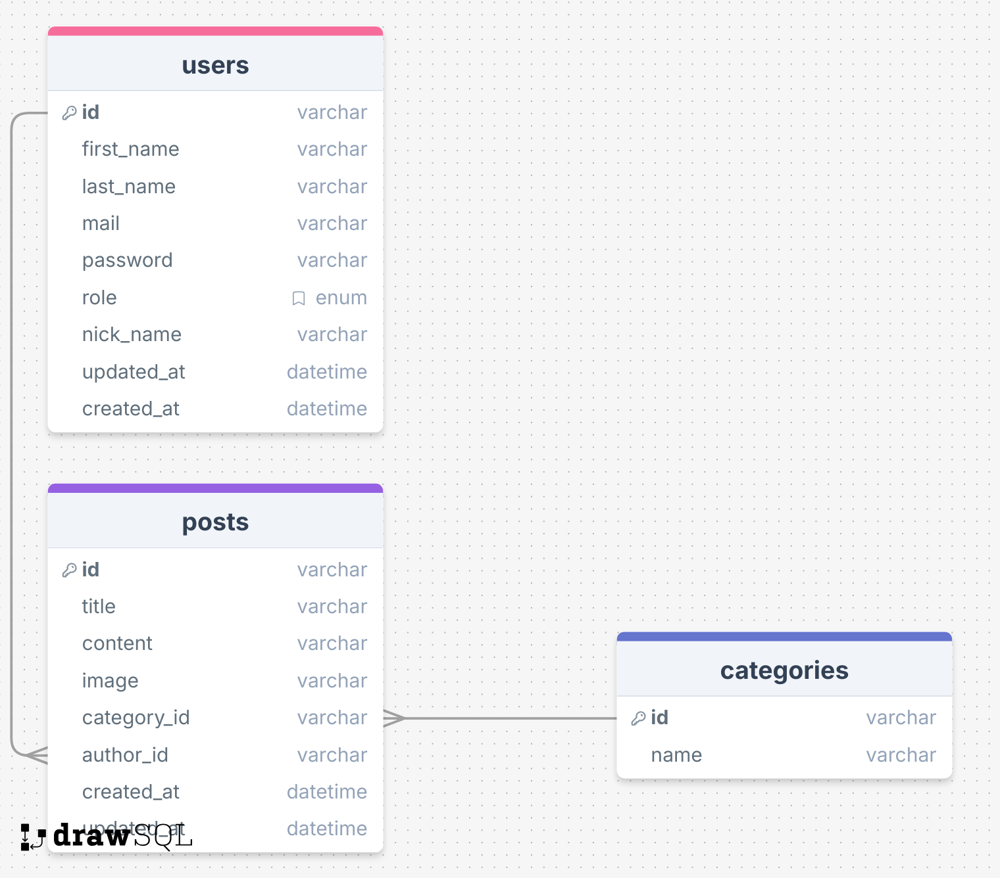

# CELESTIAL BLOOM SERVER

## Descripción

Celestial Bloom Server es el backend de la plataforma Celestial Bloom, diseñado para la gestión de artículos sobre descubrimientos en Botánica y Astronomía. Está desarrollado con Node.js, TypeScript y Express, empleando Sequelize junto con MySQL para la gestión de datos, y JWT para la autenticación segura de usuarios.

## Características principales

- API RESTful con operaciones CRUD completas para descubrimientos astronomícos y botánicos.
- Pruebas unitarias implementadas con Jest para asegurar la calidad y confiabilidad del código.
- Gestión eficiente de datos y manejo de peticiones concurrentes.
- Integración con base de datos MySQL mediante el ORM Sequelize.
- Middlewares especializados para autenticación y control de acceso.

## Arquitectura del proyecto

La estructura de carpetas y archivos principales es la siguiente:

```
CelestialBloom-Server/
├── src/
    ├── config/
    ├── controllers/
    ├── database/
    ├── middlewares/
    ├── models/
    ├── routes/
    ├── utils/
    ├── validations/
    ├── app.ts
├── tests/
├── .env
├── .env.test
├── .gitignore
├── jest.config.ts
├── README.md
├── package.json
├── package-lock.json
├── tsconfig.json
```
- **src/**: Contiene la lógica principal de la aplicación, incluyendo servicios, utilidades y otros módulos centrales.
- **config/**: Configuraciones generales y de entorno.
- **controllers/**: Lógica de negocio y controladores de las rutas.
- **database/**: Gestión de la base de datos y migraciones.
- **middlewares/**: Para autenticación, validación y control de acceso.
- **models/**: Definición de los modelos de datos.
- **routes/**: Definición de las rutas de la API.
- **utils/**: Funciones auxiliares reutilizables.
- **validations/**: Funciones para la validación de datos.
- **app.ts**: Punto de entrada de la aplicación.
- **tests/**: Pruebas unitárias.
- **jest.config.ts/**: Configuración de Jest para pruebas unitarias.
- **package.json / package-lock.json**: Dependencias y scripts del proyecto.
- **tsconfig.json**: Configuración de TypeScript.

## Implementaciones y uso

### Instalación

1. Clona el repositorio:
   ```bash
   git clone https://github.com/Sylva-Organization/CelestialBloom-Server.git
   ```
2. Accede al directorio del proyecto:
   ```bash
   cd CelestialBloom-Server
   ```
3. Instala las dependencias:
   ```bash
   npm install
   ```

### Archivo .env.example

Incluye variables como:

- Crea el archivo `.env`
    ```
    DB_NAME=
    PASSWORD_DB=
    USER_DB=
    DB_DIALECT=mysql
    HOST=localhost
    JWT_SECRET=
    JWT_EXPIRES=7d
    ```
- Crea el archivo `.env.test`
    ```
    DB_NAME=XXXX_test
    PASSWORD_DB=
    USER_DB=
    DB_DIALECT=mysql
    HOST=localhost
    JWT_SECRET=
    NODE_ENV=test
    ```

### Inserir categorias en la base de datos
    ```
    insert into celestialbloom_db.categories ( name, created_at, updated_at)
    values ('botanica', now(), now());
    insert into celestialbloom_db.categories ( name, created_at, updated_at)
    values ('astronomia', now(), now());
    ```
### Caso sea necesario cambiar el role de un usuario para administrador:
    ```
    update celestialbloom_db.users set role = "admin" where id = 1
    ```

### Ejecución

```bash
npm start
```

### Pruebas

```bash
npm run test
```

### Ejemplo de uso

Una vez iniciado, consulta la colección de Postman incluida en la documentación para ejemplos de endpoints y peticiones.

## Tecnologías

- **Lenguajes:** TypeScript, JavaScript
- **Frameworks:** Express
- **Base de datos:** MySQL
- **Herramientas:** Node.js, Postman, Jest

## Estructura de tablas



## Documentación de la API

La documentación detallada de los endpoints, parámetros y respuestas está disponible en una colección de Postman junto con el repositorio.

[Clique aquí](https://documenter.getpostman.com/view/46421388/2sB3QNqp4w)

## Licencia

Consulta el archivo `LICENSE` para detalles sobre la licencia de uso.

## Contacto

Para consultas o soporte:
- 🏢 **Organización:** [Celestial-Bloom](https://github.com/Sylva-Organization)

